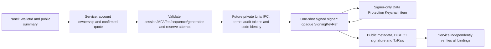

# ADR-TX-002 — key custody architecture and threat model

Status: DESIGN READY FOR SYNTHETIC IMPLEMENTATION ONLY (V2.1T). Real user keys NOT AUTHORIZED; real TX DISABLED. No production provider, key creation/import, SecItem operation, provisioning change, packaging change or broadcast is implemented by this ADR. V2.1S remains the offline synthetic baseline.

## 1. Decision and trust boundaries

Recommend custody of **one account-specific derived secp256k1 private scalar (32 bytes)**, not a BIP39 seed or mnemonic. The future signed, one-shot native Go signer is the only process entitled to retrieve it. The panel receives a service-issued WalletId and a public display projection; the Java service receives public metadata and a SigningKeyRef, never scalar/seed/mnemonic. Neither receives a generic signing capability. A successful Keychain read alone never authorizes signing.

Secure Enclave's published key support is NIST P-256, not native secp256k1. The planned software secp256k1 scalar must enter helper memory. This is protected software custody, **not hardware non-exportable secp256k1**. Touch ID/user presence can protect retrieval, not change the signing curve or guarantee non-exportability. [Apple Secure Enclave](https://developer.apple.com/documentation/security/protecting-keys-with-the-secure-enclave).



The current V2.1S stdio helper is unchanged and cannot retrieve real keys. The diagram is a future custody contract, not a currently enabled path.

## 2. Custody alternatives

| Unit | Blast radius / exposure | Backup / recovery | Multi-account / HD | Complexity / migration | Decision |
|---|---|---|---|---|---|
| A: derived account scalar | One account per compromised item; briefly plaintext in helper | Cannot reconstruct seed or sibling accounts; loss without separate recovery is permanent | Independent KeyRefs later; no remaining root for deriving siblings | Smallest provider; explicit new-account migration | Recommended initial unit |
| B: BIP39 seed | All derived accounts exposed; root seed and derivation working state enter memory | Standard wallet recovery possible, but seed export/import becomes a separate sensitive boundary | Supports fixed-policy derivation and multiple accounts | More derivation/version/backup policy; larger blast radius | Defer |
| C: mnemonic text | Same root exposure plus immutable strings, text parsing and display/copy risks | Human recovery possible; storage/export UI becomes critical | Same as seed after conversion | Adds language/checksum/normalization and UI attack surface | Do not persist in MVP |
| D: encrypted local blob + Keychain wrapping key | Plaintext still in helper; wrapping-key compromise may expose every blob | Recovery requires both blob and correct wrapping key; device-only wrapping still loses recovery | Can encode many units but broadens scope | AEAD/version/nonce/AAD/atomic file/rollback/recovery handling | No initial benefit over one SecItem scalar |
| E: external/hardware wallet | Hardware-specific key retention can reduce host extraction; software extension is different | Vendor/device/seed recovery rules | Device-dependent Cosmos/DIRECT and account support | Device approval/transport/UX and independent vector qualification | Preferred alternative when recoverability/non-exportability is essential |

A device-bound single-account wallet is acceptable as a **synthetic development model**, not automatically as a product handling funds. Before real keys/funds, the owner must explicitly accept the loss consequences or approve a safe recovery/external-wallet design. If recoverable assets are essential, A without recovery is insufficient: choose E or design an independent recovery boundary first. No export button or backup secret is added now.

## 3. WalletId, SigningKeyRef and public metadata

Conceptual value contracts (documentation only):

- WalletId: random 128-bit opaque lowercase hex identifier, issued by the service, scoped to an authority account and wallet catalog. The panel may select only IDs returned for its authorized account.
- SigningKeyRef: a different random 128-bit identifier, exactly 32 lowercase hex characters. It is non-secret, but guessing it grants no access. Service-owned WalletId -> SigningKeyRef mapping is checked against account ownership, ACTIVE state, algorithm, network and version before launch.
- KeyMetadata: formatVersion=1, walletId, signingKeyRef, compressed 33-byte publicKey, canonical BYX address, algorithm=cosmos-secp256k1, networkFamily=BYX, allowedChainId=byx, createdAt, lifecycleState, origin, accessPolicyVersion. No scalar/seed/mnemonic/persistent SecItem reference. The panel projection omits SigningKeyRef and all item-location attributes.

The existing TxValues.KeyRef(label) is a sender alias, while TxKey.keyId is the resolved signer reference. Neither is silently redefined. Future typed WalletId/SigningKeyRef APIs and a versioned authenticated custody protocol must replace alias-driven selection explicitly. V2.1S `synthetic` remains a test-provider reference; no production fallback to a test key or permissive label lookup.

Opaque IDs are independent of address, public key, file path, HD path or user email. HD m/44'/118'/0'/0/0 is a compiled derivation policy, never caller input. Multiple independent wallet/key IDs remain possible later; retaining only a scalar does not enable deriving future sibling accounts from the lost root.

## 4. Keychain item contract — proposed, not created

Use SecItem and explicitly select the Data Protection Keychain in a user login context. App-like structure and a profile authorizing restricted entitlements are required; unsigned CLI execution is not a custody model. The existing auth service's group is not reused. [Apple TN3137](https://developer.apple.com/documentation/technotes/tn3137-on-mac-keychains).

| Attribute | Proposed fixed policy |
|---|---|
| kSecClass | kSecClassGenericPassword: storage container for software scalar, not a native SecKey supporting secp256k1 |
| kSecUseDataProtectionKeychain | true on every supported SecItem operation; no file-based fallback |
| kSecAttrService | com.buynnex.byx.signer.keys.v1, compiled constant |
| kSecAttrAccount | SigningKeyRef (validated exact random-hex grammar); never a caller-provided account string |
| kSecAttrAccessGroup | APP_IDENTIFIER_PREFIX.com.buynnex.byx.signer, signer default group; prefix obtained from its approved profile, not assumed equal to Team ID |
| kSecAttrSynchronizable | false explicitly in add/query/update/delete; no SynchronizableAny production lookup |
| kSecAttrAccessible | candidate kSecAttrAccessibleWhenUnlockedThisDeviceOnly |
| kSecAttrAccessControl | optional approved SecAccessControl created with that accessibility class and presence policy; not supplied together with a conflicting kSecAttrAccessible query/add attribute |
| kSecAttrLabel | fixed non-sensitive namespace label; no email/address/memo or credential text |
| kSecValueData | bounded binary envelope <=512 bytes: magic/format, fixed algorithm/network, SigningKeyRef and account scalar[32]. No mnemonic/seed. Header duplicates reference/binding to detect copying under a different account. |
| Read result | kSecReturnData only inside helper; bounded data parse, scalar range [1,n-1], header/network/ref/version comparison |
| Matching | class + exact compiled service + exact account + exact access group + synchronizable=false, kSecMatchLimitOne; never enumerate/fallback across namespaces |

The custody unit remains only the scalar; header fields are non-secret integrity/context metadata. Unknown header version/algorithm/network or duplicate/invalid encoding is denied. kSecClassKey/unknown SecKey algorithms are not used to pretend native secp256k1 support.

A ThisDeviceOnly item does not migrate to another device. Cloud sync stays disabled independently of accessibility. This is not a claim that every same-device backup or privileged extraction is impossible. [Apple accessibility class](https://developer.apple.com/documentation/security/ksecattraccessiblewhenunlockedthisdeviceonly), [synchronizable restrictions](https://developer.apple.com/documentation/security/ksecattrsynchronizable).

## 5. Lock and access policy

Required behavior: locked console/session, unavailable keychain, denied policy, expired provisioning or ambiguous accessibility => no signing, no retained secret cache. KEY_LOCKED is emitted only when a trusted supported platform observation establishes lock; ambiguous OS errors map to KEY_UNAVAILABLE/KEYCHAIN_UNAVAILABLE, not guessed causes. After unlock, only an explicit new authorized attempt may proceed.

The accessibility constant is a candidate, not proof that every macOS screen-lock/session-switch state maps identically to it. Future packaged QA must test console lock, fast-user switch, sleep/wake and logged-out contexts on supported versions **before retrieval**. Do not use undocumented screen-lock notifications as the sole security decision or assume a notification closes races. If supported lock enforcement cannot be proven, real custody remains blocked; synthetic tests may explore it safely.

No secret is cached to bypass a lock. No automatic unlocking, repeated prompt, fallback item, silent key creation or restore adoption occurs.

| User-presence option | Tradeoff / candidate policy |
|---|---|
| Every transaction | Strongest initial candidate: fresh helper-owned context, no cross-request reuse; needs trusted transaction summary and bounded UI. User presence is not by itself consent to a specific amount/recipient. |
| High value only | Service-owned stronger-auth seam retained; no threshold selected. One item requiring presence on every read cannot be weakened per request; optional lower tier requires a separately approved access policy. |
| Wallet-unlock session | May reuse authentication context without caching scalar, but creates a signing window; not recommended initially. |
| Never | Lowest friction, greater consequence of trusted-service compromise; not recommended for initial real custody. |

No final UX policy is chosen. Prefer evaluating `.userPresence` as the conservative candidate (biometric or supported system authentication), and separately consider biometric-current-set revocation/recovery tradeoffs. This protects access to software bytes, not hardware signing.

Future non-interactive lookup uses an LAContext with interactionNotAllowed, not deprecated kSecUseAuthenticationUIFail. Authentication-required outcomes are distinguishable only where supported APIs/policy provide evidence. [Apple API deprecation](https://developer.apple.com/documentation/security/ksecuseauthenticationuifail), [LAContext](https://developer.apple.com/documentation/localauthentication/lacontext/interactionnotallowed).

Interactive consent must be an explicit helper-owned operation with a bounded deadline and cancellation. Do not simply expand the existing synthetic 2-second request timeout. First authenticate caller and validate request; then perform presence evaluation without retaining a scalar while UI waits; obtain a fresh service authorization/quote lease; finally retrieve and sign. Whether evaluateAccessControl/LAContext can preauthorize the exact SecItem without a second prompt is a **future compatibility test**, not established here. If retrieval itself demands interaction, deny that attempt and require a reviewed explicit interaction flow. Expired quote/session/sequence/generation after UI => invalidate, release, exit. The helper gets no auth/session/MFA token; the service owns revalidation. Presence wait and crypto exchange need separate fixed deadline/cancel semantics in the future protocol.

## 6. Actual packaging audit and future identity

Read-only audit of `byx-packaging/build/BYX-MVP.app` on 2026-10-08 UTC:

| Component | Actual identifier / Team | Actual effective entitlements | Profile / validity |
|---|---|---|---|
| Panel | com.buynnex.byx / W5Z65G9UP2 | allow-jit=true only | No embedded profile; strict deep signature verification PASS |
| Service | com.buynnex.byx.service / W5Z65G9UP2 | allow-jit=true, application-identifier=W5Z65G9UP2.com.buynnex.byx.service, team-identifier=W5Z65G9UP2 | Embedded development profile, expiration 2026-10-13 16:49:55 UTC, valid at audit; strict deep verification PASS |
| Signer | ABSENT | None | None; proposed com.buynnex.byx.signer, not registered/provisioned here |

Both current executables have Hardened Runtime (flags 0x10000). DRs are `identifier "<role id>" and anchor apple generic and certificate leaf[subject.OU] = W5Z65G9UP2`. Service profile prefix is W5Z65G9UP2. Its permitted `keychain-access-groups=[W5Z65G9UP2.*]` is a provisioning allowlist, **not an emitted grant of all groups to the running service**. Effective rights derive from its actual signed entitlements; today's service has only its own default application-identifier group. [Apple sharing/access groups](https://developer.apple.com/documentation/security/sharing-access-to-keychain-items-among-a-collection-of-apps), [TN3125](https://developer.apple.com/documentation/technotes/tn3125-inside-code-signing-provisioning-profiles).

Future signer needs its own app-like nested bundle/profile/application-identifier and team-identifier. Prefer its private default group, no sharing to panel/service, no auth access group or App Groups. QA uses a **different** signer QA app ID/default group/service namespace. Native Go has no JIT requirement; do not copy JVM allow-jit, disable-library-validation, get-task-allow, DYLD injection or broad file/network rights to it. Candidate App Sandbox=true with no network client/server entitlement; compatibility with native Keychain, local IPC and approved UI must be qualified. Existing app/service entitlements remain unchanged.

Likely layout (design only):

```
BYX-MVP.app/Contents/Helpers/
  byx-local-service.app/Contents/MacOS/byx-local-service
  byx-signer-helper.app/Contents/MacOS/byx-signer-helper
                       Contents/Info.plist
                       Contents/embedded.provisionprofile
```

Use the existing sibling app-like helper topology, sign nested content inside-out, validate nested/root resource seals, notarize/release separately when authorized. Future release requires approved immutable installation, expected Team, role identifier, DR, profile and release identity. The current user-writable dev build is **not** that installation proof. User ownership/non-group-writability/SHA checks in V2.1S are development checks, not a race-free production installation.

## 7. Direct invocation, caller authentication and IPC decision

A valid helper signature grants Keychain eligibility; it does **not** prove a signing caller is authorized. Caller identity must be authenticated **before any SecItem lookup or presence prompt**.

| Option | Identity / freshness | Decision |
|---|---|---|
| Existing private stdio + getppid/name | Pipes are not credential-bearing sockets; PID/name alone races and cannot authenticate code/version | Keep only for current synthetic harness; insufficient for real custody |
| Stdio + inherited socketpair control FD | Can authenticate creator service to helper, but native probe shows both endpoint tokens refer to creator; not symmetric helper identity. Also requires custom JVM FD passing. | Possible with extra independently verified child identity, but unnecessary complexity |
| Private per-invocation connected AF_UNIX socket, framed one-shot protocol | Kernel audit tokens on connected endpoints identify each endpoint's actual creator; existing service MacSecurity/PeerIdentity already uses this mechanism | **Recommend for future custody**, with tests below; no change now |
| TCP/HTTP/gRPC or generic wallet daemon | Larger networking/routing/persistent-state surface | Reject |

Native mechanism probe (unsigned Python fixtures, no Keychain) confirmed socketpair peer PID remained parent PID after child exec. A fresh connected AF_UNIX listener created by the child and client created by the parent returned child token to parent and parent token to child, including pidversion, matching actual spawned PIDs. This proves mechanism feasibility **only**; signed-parent/custody authorization remains NOT TESTED.

The future one-shot helper binds one endpoint in a fresh, exclusive 0700 invocation directory under an OS-derived per-user runtime root, socket mode 0600; reject symlink/owner/path anomalies. The component/path namespace is compiled; it never receives a Keychain/file/HD lookup path. A bounded public invocation ID may be bootstrapped via stdin to derive the ephemeral IPC location; it is not a credential. The service connects only to the directory for its directly spawned, still-live child. Anonymous stdio data signing is disabled in the future custody build; no fallback. Socket paths add limited IPC filesystem activity, not user-wallet file access. Cleanup occurs on success/failure; no persistent listener, no arbitrary path selection, no TCP port.

Before reading signing payload/key data, helper obtains `getsockopt(SOL_LOCAL, LOCAL_PEERTOKEN)` from accepted socket. It supplies this **kernel token**, not request-supplied PID/token, to SecCodeCopyGuestWithAttributes(kSecGuestAttributeAudit), checks live code against the service DR/Team/identifier and strict nested bundle seal, and checks actual code origin within the approved same host bundle/release. The token includes PID instance version. Service does the reciprocal check against the signer role and its expected direct child. Apple [guest-code lookup](https://developer.apple.com/documentation/security/seccodecopyguestwithattributes(_:_:_:_:)), [audit attribute](https://developer.apple.com/documentation/security/ksecguestattributeaudit). Local SDK sys/un.h confirms LOCAL_PEERTOKEN=0x006; current MacSecurity contains the native binding and PID+pidversion handling.

`getppid()` must match the authenticated service token's PID as an **additional direct-parent constraint**, never as the identity authority. Kernel token/live code object, direct Process handle, PID instance, origin and seal are checked together. No trust in argv, names, UI fields, getpeereid UID alone or same user. Reparenting, parent death, missing token, unavailable validation or instance mismatch denies. Fresh code/token/parent validation occurs at the pre-access boundary and before releasing output; no cache of positive authorization across invocations. Remaining timing windows are constrained by an immutable installation and channel lifetime; do not claim an atomic lifetime guarantee against root or compromised trusted code.

Both roles require signed/sealed expected identities and approved release origins. Same Team with wrong bundle ID is denied. A copied genuine helper remains genuinely signed and might otherwise be Keychain-eligible: self/origin/host-layout validation and caller gate deny it before lookup. A copied service in user-writable storage must fail the origin/installation policy even if DR is valid. If callers cannot be strongly qualified on the supported platform, real provider stays unavailable; no PID-only fallback.

Service launch uses fixed absolute bundle-relative path, direct exec/spawn, fixed arguments and cleared environment. Before lookup the helper verifies its own identity/profile/origin plus authenticated parent. Terminal/another app/unsigned same-user process/test JVM => CALLER_UNTRUSTED; no prompt and no key access. A genuine service launched directly must still enforce its auth/quote gates; there is no generic service 'invoke signer' IPC operation.

### Request authenticity and replay

The future custody protocol is explicitly versioned separately from V2.1S synthetic v1. Kernel-authenticated channel and private endpoint supply origin protection; adding a shared MAC key would merely create another secret/custody problem and would not fix compromised service code. Do not add a long-term/ephemeral signing MAC just for appearance.

Use a fresh helper challenge (256-bit non-secret nonce) plus per-launch invocation ID, with service response committing the same nonce, request ID, Body/AuthInfo/SignDoc binding, metadata version and bounded operation lease. Challenge changes every invocation; previous transcript/request cannot be accepted on a new process. Limit one authorized sign and one bounded response per process; reject duplicate/unknown messages, stale lease, changed binding and trailing frames. No network-resumable session. Service owns reserved attempts/idempotency/quote expiry and durable lifecycle checks; helper owns single-use challenge/deadline. Expired/uncertain attempts require new explicit confirmation, never automatic resend.

Nonce is freshness, not caller authentication. No session/MFA/admin/peer-auth token, arbitrary Any/chain/HD path or secret crosses signing IPC. Approved high-value authorization remains a service policy hook, with no numeric threshold chosen.

## 8. Authorization before access and lookup

Required sequence: service resolves WalletId for authenticated account -> validates ACTIVE/version/network metadata -> confirmed quote -> fresh session/auth/MFA/elevation/fee/sequence/generation/expiry check -> reserves attempt -> launches qualified helper -> authenticates both endpoints -> validates closed BankSend/DIRECT request and challenge -> optional explicit presence step -> fresh service lease/cancellation check -> exact helper-only SecItem query -> compares protected envelope/ref/algorithm/network -> derives actual pubkey/address and compares service-owned metadata -> signs -> best-effort clears -> sends only bounded public response -> exits.

Prepare/quote never launches a private provider. Panel from-address/pubkey/KeyRef fields cannot override service-owned identity; future panel sends only WalletId selection and quote confirmation. No account/service/access-group/persistent SecItem ref supplied by caller is used as lookup authority. Namespace/version/query constants are compiled; lookup never searches auth, legacy wallets or another user's namespace.

The helper derives public key/address from the retrieved scalar and verifies them against catalog expectations and item header before signing. The Java service independently verifies the returned pubkey/address, low-S signature, DIRECT bytes, exact TxRaw, hash, quote/request/intent binding, preserving V2.1S checks. Metadata corruption, a copied item under another keyRef, wrong scalar or wrong public metadata fails closed. Successful SecItem retrieval cannot turn another intent into an authorized transaction.

## 9. Persistence and lifecycle

Conceptual owner: **service-owned authority wallet catalog**, a separate versioned public-metadata domain within the encrypted/integrity-protected authority. No wallet private material or opaque raw signing capability is stored there, and nothing returns to panel.db. Reusing authority protection for non-secret metadata is justified by existing account-ownership/rollback enforcement; it is not sharing the wallet secret item/group. Future schema/migration must preserve wallet ownership and independent lifecycle. Auth reset/deletion/profile migration must not implicitly delete or adopt a wallet.

Lifecycle: ACTIVE -> REVOKED -> PENDING_DELETE -> DELETED. LOCKED is an observed temporary availability overlay, not durable revocation; it may overlay ACTIVE. DELETED preserves a non-secret tombstone/version so restoration cannot resurrect a deleted key. Revocation makes the service refuse launch; deletion requires explicit high-risk confirmation, draining/cancelling operations and separate authorization. A remaining item after failed deletion remains revoked; never silently re-enable it. Rotation is a **new keyRef/address**, not changing bytes under an old reference; fund movement is a separately authorized future transaction, not custody rotation.

State in protected item and authority must agree; cross-store creation/delete is not atomic. Future creation uses a pending catalog entry/receipt reconciliation and deterministic cleanup; unregistered orphan items are not automatically adopted. Helper-only namespace tombstone/reconciliation design must prevent an old valid authority snapshot from reactivating revoked/deleted items before real deployment. Public metadata alone is not proof of current custody ownership or revocation state.

## 10. Creation, import, recovery and reinstall (design only)

Future creation: explicit authenticated high-risk service action -> qualified custody helper -> OS CSPRNG inside boundary -> transient BIP32 root/derivation working state -> **fixed** m/44'/118'/0'/0/0 secp256k1 derivation -> retain only the account scalar -> create protected envelope/item -> wipe transient root/intermediates best effort -> return publicKey/address/keyRef only. No BIP39 mnemonic is needed or returned; root seed is not persisted. Entropy/derivation must be qualified before real keys exist. A directly random scalar is a distinct origin policy and must not be mislabeled as HD-derived; it is not silently substituted for this fixed-HD design. Multi-account later needs independent new roots/keys or a separately approved seed model.

Import for first version: **blocked**. Alternatives are a signer-owned native trusted input UI or separate narrowly signed import helper (larger entitlement/UI boundary), or external wallet ownership. Panel/service text fields, clipboard, argv, environment, files and logs are unacceptable import paths. No generic import/seed API is added. Later import must have its own threat model, consent/recovery proof and explicit authorization.

Backup/recovery: this scalar-only, ThisDeviceOnly proposal is device-bound and has no initial secret export/recovery. Losing item/device without an approved separate backup loses signing ability permanently. Public metadata restore is not wallet recovery. Never generate replacement bytes under an existing keyRef/address. Metadata restored without item => KEY_NOT_FOUND/wallet unavailable; incompatible context/profile => KEYCHAIN_UNAVAILABLE rather than falsely claiming missing key.

Reinstall: item survives but metadata is absent => orphan, not automatic adoption; require an explicit authorized recovery/reconciliation proof. Metadata survives but item is absent => unavailable; no regeneration. Reinstall under changed Team/access group/device cannot assume item accessibility. Expired profile renewal may restore eligibility to an existing item only after full identity checks; it does not authorize wallet import/adoption. Before real funds, backup/recovery/product acceptance and safe delete/rotate/reconcile are unresolved deployment gates.

## 11. Memory, diagnostics, environment, FDs and confinement

Future scalar lifetime: authenticated lookup -> bounded deserialize -> derive/compare pubkey -> sign exactly once -> overwrite mutable native/Go buffers and crypto scalar best effort -> release CFData/native handles -> exit. Never cache across requests or convert secret to hex/JSON/string/error. Minimize copies, fixed-size buffers and scopes; no key-bearing goroutine channels or closures, no dumps during panic. One-shot limits residency but cannot defeat all OS/runtime copies.

Go's current collector is non-moving for heap objects; stack growth, conversions, crypto/native bridges and compiler optimizations still matter. GC reclamation/CFRelease does not securely erase data. Explicit zeroing and runtime.KeepAlive can help manage reachable buffer lifetime but do not guarantee erasure of copies or prevent optimization artifacts. Qualify with compiler escape/assembly inspection on synthetic buffers only; do not promise secure erase. [Go GC guide](https://go.dev/doc/gc-guide), [runtime.KeepAlive](https://pkg.go.dev/runtime#KeepAlive).

Future hardening candidates: per-process RLIMIT_CORE=0 before retrieval; redacted panic handling with fixed error and exit; no get-task-allow, debug agents, DYLD injection or library-validation disablement; hardened runtime and an approved debugger restriction where supported/compatible. Test these rather than assume Go/runtime compatibility. Crash reporters/system diagnostics may still expose memory; no guarantee of suppressing all reports or swap/hibernate pages. Optional locked native buffers are best effort and do not protect all crypto/CFData copies. No global sysctl/SIP/FileVault/security setting change is authorized. Root/kernel compromise and a compromised signing identity are outside this software custody guarantee.

Allowlisted environment for native crypto: empty by default; add a specific required locale/UI variable only after qualification, never from arbitrary caller input. No DYLD_*, PATH, HOME, TMPDIR, JAVA_*, CLASSPATH, GO debug/plugin/config/trace variables; do not look up wallet/config directories. OS APIs derive the narrow IPC runtime location. Redacted audit: event/result/request-prefix/timing only; no scalar/seed/mnemonic, TxRaw, full signature, memo/recipient/amount, token or uncontrolled OS error/panic message. A future panic path releases known buffers best effort and aborts; it never serializes panic value or stack/local data to stdout/stderr.

FDs: only controlled stdin bootstrap, protocol socket, closed/discarded stdout/stderr and unavoidable runtime descriptors; CLOEXEC by default, enumerate/close inherited non-allowlisted descriptors before secret access. No service DB handles, auth-secret FDs or AF_INET/AF_INET6 sockets inherited. Do not claim Java ProcessBuilder alone proves that list; qualify the native spawn/FD path.

NO NETWORK means no IP/DNS/HTTP/RPC, only the explicitly allowed local AF_UNIX signing channel. Candidate App Sandbox denies network client/server and user-file entitlements; hardened runtime alone is not a network sandbox. No broad permissions or sandbox-exec workaround. Qualify outbound/listen/raw attempts and inherited socket denial with synthetic fixtures. App Sandbox still has standard loader/container/runtime access; do not claim zero OS filesystem access. Only IPC directory/socket maintenance is added; no ~/.byx, ~/.cosmos, Keplr, wallet JSON or seed file reads.

The new **test-only** production dependency/source guard verifies current helper has no net/net/*, os/exec/plugin or unreviewed external dependencies and no os wallet/config/environment lookup calls. This is a narrow current source/dependency proof, not an OS sandbox or proof against future native code. Future Darwin Security/AF_UNIX bridge must be separately reviewed/qualified; no such bridge is implemented now. [Apple App Sandbox](https://developer.apple.com/documentation/security/protecting-user-data-with-app-sandbox), [network entitlement behavior](https://developer.apple.com/documentation/bundleresources/entitlements/com.apple.security.network.server).

## 12. Closed failure taxonomy (future contract)

| Code | Evidence / action |
|---|---|
| KEY_NOT_FOUND | Qualified caller/context and exact namespace query genuinely lacks item; never create automatically |
| KEY_LOCKED | Supported lock observation establishes locked state; no cache/fallback/prompt loop |
| KEY_UNAVAILABLE | Ambiguous or unavailable eligibility; deny without guessing lock/auth cause |
| KEY_ACCESS_DENIED | Auth/policy/user denial; explicit retry only, no automated prompt |
| KEY_ACCESS_TIMEOUT | Bounded item/presence operation deadline; cancel context, wipe, exit |
| USER_INTERACTION_REQUIRED | Noninteractive exact policy requires explicit consent; no automatic escalation |
| USER_INTERACTION_CANCELLED | Explicit user cancellation; no retry loop |
| KEY_CORRUPT | Bounded envelope/scalar validation fails |
| KEY_ALGORITHM_MISMATCH | Fixed cosmos-secp256k1 algorithm differs |
| KEY_ADDRESS_MISMATCH | Actual scalar-derived pubkey/address differs from authoritative expected metadata |
| KEY_VERSION_UNSUPPORTED | Unknown catalog/item/protocol version; no legacy fallback |
| KEY_REVOKED | Catalog/protected lifecycle denies key use |
| KEY_NETWORK_MISMATCH | Key family/chain binding differs from fixed byx |
| CALLER_UNTRUSTED | Missing/wrong kernel token, role/team/origin/parent/lease; no SecItem query |
| HELPER_IDENTITY_INVALID | Wrong helper role/seal/origin/profile or substituted helper; no launch/use |
| KEYCHAIN_UNAVAILABLE | Unsupported DP context, unavailable entitlement/profile/backend; no file-based fallback |
| SIGNING_FAILED | Unknown internal/provider/OS failure or invalid returned crypto; fixed redacted error |

These errors are not implemented in current TxError. Future service maps unknown/native failures safely to SIGNING_FAILED while preserving known distinctions for recovery UX; it must not expose raw OS strings, secret data or an existence oracle to unauthorized callers. V2.1S remains its existing SIGNING_FAILED behavior.

## 13. Threat / tamper matrix

Assume trusted OS/code-signing/Keychain, uncompromised approved signer/service code and signing credentials, enforced installation permissions, and active user login context. Same-user hostile apps/UI/files are adversarial. DoS is possible; availability never justifies relaxing admission. Service RCE can request harmful signatures through its authorized role, so independent helper structural validation and candidate user presence/transaction consent reduce consequences but do not prove user intent against all RCE. Helper RCE can expose a retrieved software scalar. Root/kernel/certificate compromise is not prevented by this software design.

| Attack | Detection / mitigation | Fail state / residual |
|---|---|---|
| Helper replaced/modified | Static/dynamic DR, Team/role, release origin, strict host/nested seal and immutable install | HELPER_IDENTITY_INVALID; no read |
| Service replaced/modified | Kernel audit identity, expected service DR/role/origin, seal, launch-environment checks; qualified release policy | CALLER_UNTRUSTED; trusted-service RCE remains residual |
| KeyRef changed/guessed | Service ownership map + catalog authenticity + exact opaque grammar + protected envelope ref | Unauthorized selection denied before launch; mismatch KEY_CORRUPT/KEY_NOT_FOUND only after trusted query |
| Metadata altered | Authority integrity/rollback protection; helper derives pub/address from scalar | Fail catalog verification or KEY_ADDRESS_MISMATCH |
| Wrong pubkey/address | Helper compare and independent Java response verification | KEY_ADDRESS_MISMATCH / SIGNING_FAILED |
| Wrong algorithm/version/network | Fixed catalog/item/protocol validation | KEY_ALGORITHM_MISMATCH / KEY_VERSION_UNSUPPORTED / KEY_NETWORK_MISMATCH |
| Item copied to another reference | Group eligibility plus protected envelope ref/network/version and derived pub/address check | Denied/KEY_CORRUPT; same authorized namespace compromise remains residual |
| Direct Terminal/unsigned/other-app invocation | Kernel peer+parent identity before any secret lookup/prompt | CALLER_UNTRUSTED; may cause local DoS but no scalar read |
| Same Team, wrong role ID | Role-specific DR, not Team alone | CALLER_UNTRUSTED |
| Genuine copied helper/service | Approved canonical origin/host layout/install policy plus caller authorization | HELPER_IDENTITY_INVALID / CALLER_UNTRUSTED; signature alone is insufficient |
| PID reuse/parent exit/exec | Kernel PID instance token, actual child handle, fresh live-code/parent checks, channel EOF/cancel | CALLER_UNTRUSTED/SIGNING_FAILED; no PID-only fallback |
| Socket injection/replay/FD theft | Private one-shot endpoint, credentials before parse, fresh challenge/binding, no FD transfer, attempt reservation | Deny; stolen trusted-process rights imply a broader compromise |
| Debugger/dumps/swap | Hardened runtime, no debug rights, core-limit candidate, no cache, bounded lifetime/wipe | No universal extraction guarantee; qualified restriction failure blocks real custody |
| Screen lock during UI/sign | Qualified lock/presence/lease checks and cancellation; no secret cached through UI | KEY_LOCKED/KEY_UNAVAILABLE/KEY_ACCESS_TIMEOUT |
| Snapshot rollback/reinstall | Version/tombstones/anchor and cross-store reconciliation; no key regeneration/adoption | KEY_REVOKED/KEY_NOT_FOUND/KEYCHAIN_UNAVAILABLE |
| Malicious panel summary/from address | Service owns wallet/intent/quote; helper closed bytes; future trusted consent summary | Deny mismatched quote/metadata; panel never receives signer handle |
| Crash/partial response/prompt denial | Bounded deadlines, no partial success/broadcast, redacted errors, explicit retry | SIGNING_FAILED/KEY_ACCESS_TIMEOUT/KEY_ACCESS_DENIED |

## 14. Synthetic-only implementation and packaged qualification plan

First implement mock/fake Keychain adapter and closed value/protocol contracts using only existing vector or explicit synthetic fixture bytes, never a user's wallet. Tests must prove caller rejection occurs **before** a provider query via counters, no ambiguous error PASS, no unauthorized existence/prompt oracle, deterministic cleanup and all tamper cases. No real user key, seed/mnemonic/import/broadcast in that phase.

Then, only with separate authorization, a QA signer app-like bundle/profile/default access group and `com.buynnex.byx.signer.qa.keys.v1` namespace may store bounded synthetic canary material. Use manifest-recorded random item IDs, positive control, strict cleanup (including after crash), absence verification through qualified holder and fail if orphaned. No production-group access and no auth namespace; do not claim deletion when not checked. A temporary file-based keychain/mock cannot prove DP entitlements/lock/presence: file-based SecKeychainCreate is deprecated and uses a different model. Native DP qualification needs dedicated QA access group and actual signed/profiled roles. [Apple TN3137](https://developer.apple.com/documentation/technotes/tn3137-on-mac-keychains).

| Parent/identity test | Future expected result | Qualification now |
|---|---|---|
| Approved signed service, actual child helper, current lease | Allowed on synthetic QA group only | NOT RUN |
| Terminal -> production helper | CALLER_UNTRUSTED, zero provider queries/prompts | NOT RUN |
| Generic test JVM/Python/unsigned same-user process | Denied before lookup | Kernel fixture probe only; signed policy NOT RUN |
| Wrong Team service | Denied | NOT RUN; requires a second controlled identity |
| Same Team, wrong bundle ID | Denied | NOT RUN |
| Copied genuine helper / copied service | Origin/install policy denial, not assumed loss of entitlement | NOT RUN |
| Modified signed bundle/config/JAR | Seal/signature rejection | Current bundle seals PASS; malicious signer matrix NOT RUN |
| Parent exit/PID churn/token mismatch/FD substitution | Fail closed; no use of reused PID | NOT RUN |
| Replayed/changed challenge/lease/quote binding | Deny, no provider call or second signature | NOT RUN |

| Access-group test | Future proof obligation | Qualification now |
|---|---|---|
| QA signer holder | Positive read/use and cleanup of same synthetic item | NOT RUN |
| Panel | Cannot read wallet secret despite authenticated user/UI selection | NOT RUN |
| Service | Cannot read wallet secret despite owning catalog/keyRef | NOT RUN |
| Foreign same-user process/ad-hoc/copy | Cannot bypass caller/group policy | NOT RUN |
| QA vs production vs auth namespaces | No item/group collision or accidental production lookup | NOT RUN |
| Locked/session switch/profile expiry/denial/presence wait | Correct denial/cancellation, no stale secret cache/prompt loop | NOT RUN |
| Restore/delete/orphan/rotation | No silent replacement/adoption/reactivation | NOT RUN |

Future candidate App Sandbox/network denial, inherited-FD hygiene, native memory/panic/crash handling and private UI compatibility must also be qualified. CURRENT tests: clean service suite 405/405 in one invocation, existing synthetic signing/vector boundary, new Go production network/filesystem source guard, and ephemeral non-secret kernel socket probes. None qualifies actual Keychain custody today.

## 15. Remaining gates and classification

Architecture: **READY_FOR_SYNTHETIC_KEYCHAIN_IMPLEMENTATION**. This means the unit, namespaces, caller trust, memory/metadata/recovery/error boundaries and negative test obligations are explicit enough to implement a mock/synthetic path under a separately authorized next phase.

Real custody remains blocked by: new signer/QA provisioning and emitted entitlement proof; immutable signed packaging/release origin; native authenticated AF_UNIX/parent/instance and request lease implementation; supported lock and LAContext/presence qualification; dump/FD/network/memory hardening qualification; cross-store revocation/restore reconciliation; recovery/device-loss product approval; entropy/fixed-HD creation and secure input design. None is silently satisfied by current code signing or this ADR. DEFAULT helper absent, signer/keys UNAVAILABLE, transport ABSENT, private gate=false, TX master gate=false. No production code changed in V2.1T.

REAL USER KEY: NOT AUTHORIZED. REAL TX: DISABLED. No Keychain write, mnemonic/seed generation/import, wallet adoption, node, broadcast or push in this task.
